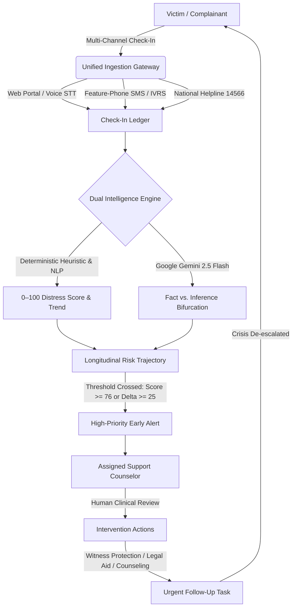
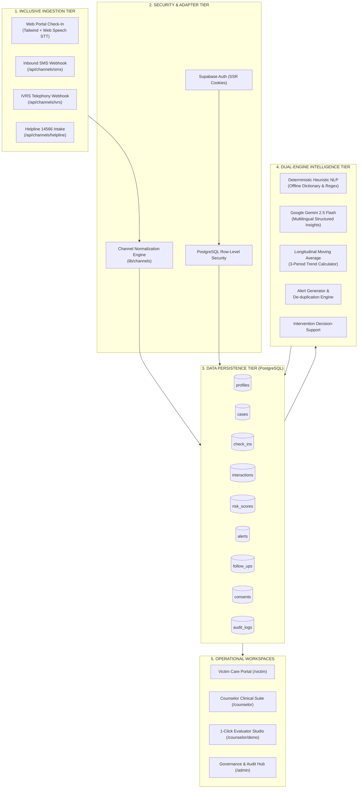
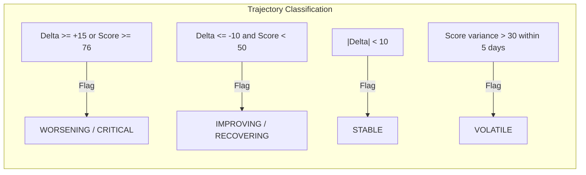
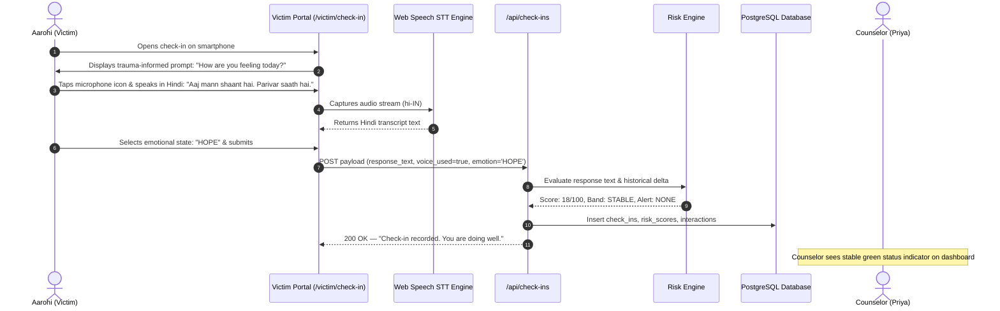
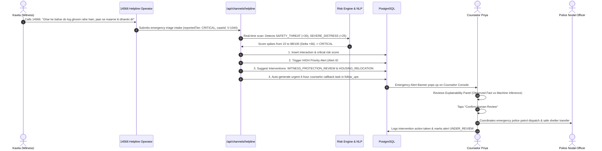
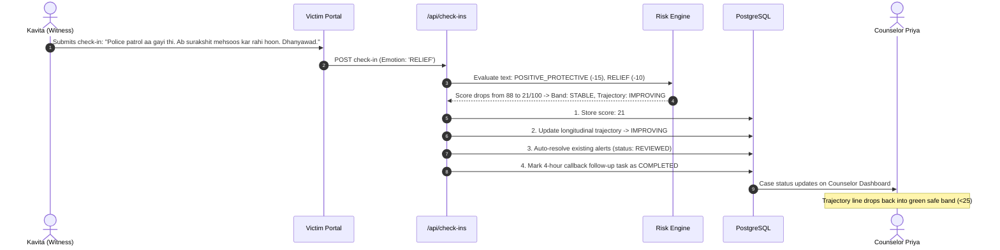
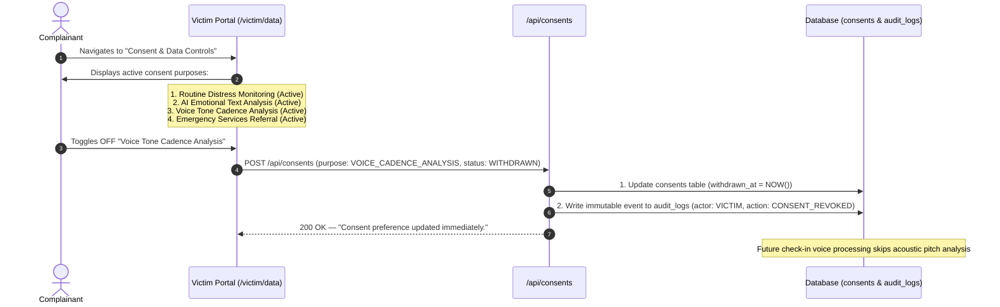

# SAHAY (सहाय) — Comprehensive System Documentation & User Flow Guide

> **AI-Based Dynamic Mental Health Monitoring & Distress Prediction System for Victims and Complainants**  
> **SIH-2026 Problem Statement: SIH26094**  
> **Platform Version:** 1.0.0 (Production-Ready Architecture)  
> **Security & Privacy Standard:** Digital Personal Data Protection (DPDP) Act 2023 Compliant • Zero-PII Architecture

---

## 1. Executive Summary & Mission

The Indian criminal justice system processes hundreds of thousands of sensitive cases annually—ranging from gender-based violence (*Protection of Women from Domestic Violence Act, 2005*) and crimes against children (*POCSO Act, 2012*) to witness intimidation, severe financial fraud, and caste-based atrocities. In the months and years between the filing of a First Information Report (FIR) and the conclusion of trial proceedings, victims and complainants endure severe secondary victimization: protracted legal uncertainty, social ostracization, physical intimidation, and acute trauma.

Traditional institutional support operates on a **reactive, episodic model**: support workers and police personnel only intervene after a crisis has erupted (e.g., suicide attempts, physical attacks, or witness hostility). 

**SAHAY (सहाय)** introduces a paradigm shift: a **proactive, dynamic, support-continuity and early-warning ecosystem**. Operating as an intelligent decision-support bridge between victims and accredited counselors, SAHAY continuously monitors self-reported well-being, linguistic distress markers, multi-channel check-ins, and longitudinal trajectories to detect crisis escalation **days or weeks before catastrophic outcomes occur**.



---

## 2. Essential Product Guardrails & Ethical Boundaries

SAHAY is engineered under strict constitutional, legal, and psychiatric guardrails:

1. **Non-Diagnostic Decision Support**: SAHAY produces *Distress Signals* and *Support-Prioritization Indicators*. It **never** issues psychiatric diagnoses (e.g., "Major Depressive Disorder") nor prescribes medication.
2. **Mandatory Human-in-the-Loop**: The platform **never** executes autonomous sensitive interventions. Relocation orders, police dispatches, and clinical referrals require explicit confirmation by a certified counselor.
3. **Observed Fact vs. Machine Inference Demarcation**: The system strictly separates verifiable empirical facts (e.g., *"Complainant stated: 'Two men are waiting outside my gate'"*) from algorithmic inferences (e.g., *"Inference: High risk of external physical intimidation"*).
4. **Privacy-by-Design & Zero-PII Aggregation**: District, state, and national oversight dashboards expose **zero victim Personally Identifiable Information (PII)**. Regulators see aggregated cohort metrics and anonymized reference hashes.
5. **DPDP Act 2023 Compliance**: Explicit, purpose-specific consent is tracked on an immutable ledger. Victims retain the legal right to inspect, pause, or withdraw their consent at any time.

---

## 3. System Architecture & Component Design

SAHAY is built on a high-throughput, fault-tolerant stack combining Next.js 16 (App Router, Server Components, and Server Actions), PostgreSQL with Row-Level Security (Supabase), Google Gemini 2.5 Flash for multimodal insight generation, and a 100% offline heuristic NLP fallback.



---

## 4. Target Personas & Role Matrix

| Role | Target User | Primary Motivations | Key Capabilities in SAHAY |
|---|---|---|---|
| **VICTIM** | Complainant, trial witness, POCSO/DV survivor | Safety, emotional validation, non-intrusive support, dignity | Low-friction voice/SMS check-ins, direct counselor link, verified national hotlines, full consent control. |
| **COUNSELOR** | Certified clinical social worker, NGO counselor | Caseload visibility, identifying high-risk clients before crisis, evidence-based briefings | Longitudinal distress charts, early-warning alerts, AI-generated case briefings, one-click follow-up scheduling. |
| **ADMIN / NODAL OFFICER** | District Legal Services Authority (DLSA) officer, supervisor | Workload equity, institutional compliance, preventing case lapses | Caseload re-allocation, staff activation, tamper-evident immutable audit ledger, system health metrics. |
| **REGIONAL OVERSIGHT** | State/Ministry official (WCD, Home Dept) | Macro-level resource allocation, identifying systemic bottlenecks | Zero-PII district hotspot heatmaps, aggregate severity distribution, intervention efficacy metrics. |

---

## 5. Mathematical Risk & Distress Engine

The SAHAY Risk Engine computes a dynamic, continuous distress score \(S \in [0, 100]\) following each interaction. The scoring is deterministic, explainable, and multi-layered.

### 5.1 Raw Signal Calculation

\[
S_{\text{raw}} = \text{Clamp}_{0}^{100} \left( S_{\text{baseline}} + \sum_{i} (w_i \times k_i) + P_{\text{disengagement}} - P_{\text{protective}} \right)
\]

Where:
- \(S_{\text{baseline}} = 15\) (standard initial baseline for active cases)
- \(w_i\): Pre-calibrated category weights based on victimology research:
  - **`SAFETY_THREAT` (\(w = +30\))**: Direct physical threats, stalking, surveillance, armed intimidation.
  - **`SEVERE_DISTRESS` (\(w = +25\))**: Panic attacks, unbearable despair, suicidal ideation indicators, insomnia.
  - **`HOUSING_INSTABILITY` (\(w = +20\))**: Forced eviction, shelter denial, lock-outs by perpetrators.
  - **`LEGAL_STRESS` (\(w = +15\))**: Upcoming court cross-examination, bail granted to accused, witness tampering.
  - **`POSITIVE_PROTECTIVE` (\(w = -15\))**: Family support, feeling secure, safe shelter, employment, legal aid assigned.
- \(P_{\text{disengagement}}\): Penalty added when check-ins lapse:
  - Lapsed \(> 3\) days: \(+5\) points
  - Lapsed \(> 7\) days: \(+10\) points

```
Distress Score Ranges & Operational Severity Bands:

  0             25             50             75            100
  ┌──────────────┬──────────────┬──────────────┬──────────────┐
  │    STABLE    │   CONCERN    │   ELEVATED   │   CRITICAL   │
  │   (Routine)  │  (Advisory)  │ (Active Mon) │  (Emergency) │
  └──────────────┴──────────────┴──────────────┴──────────────┘
```

### 5.2 Longitudinal Trend & Trajectory Calculation

To filter out single-interaction noise and detect genuine trajectories, SAHAY applies a **3-Period Simple Moving Average (SMA)** across historical check-in records:

\[
\text{SMA}_t = \frac{S_t + S_{t-1} + S_{t-2}}{3}
\]

The longitudinal delta \(\Delta_{\text{trend}}\) is computed as:

\[
\Delta_{\text{trend}} = \text{SMA}_t - \text{SMA}_{t-1}
\]



### 5.3 Early-Warning Alert Trigger Rules

An early warning alert is automatically emitted to the counselor queue when **any** of the following threshold events occur:
1. **Critical Magnitude**: \(S_{\text{current}} \ge 76 \implies\) `HIGH` Severity Alert.
2. **Acute Trajectory Spike**: \(\Delta_{\text{trend}} \ge +25\) points in \(\le 72\) hours \(\implies\) `HIGH` Severity Alert.
3. **Elevated Warning**: \(S_{\text{current}} \in [51, 75]\) or \(\Delta_{\text{trend}} \ge +15 \implies\) `MEDIUM` Severity Alert.
4. **48-Hour Anti-Spam De-Duplication**: If an identical alert was generated for the same case within 48 hours and is currently `NEW` or `UNDER_REVIEW`, redundant alerts are suppressed to prevent counselor cognitive fatigue.

---

## 6. Detailed User Flows & Real-Life Case Studies

### Case Study A: The POCSO Survivor — Routine Web & Voice Check-In

> **Complainant Profile:** Aarohi (Name pseudonymized), 19 years old. POCSO trial ongoing at District Court. Assigned counselor: Priya Sharma.  
> **Channel:** Web Portal with Web Speech API (`hi-IN`).  
> **Initial Case State:** Score 18/100 (`STABLE`), no active alerts.



**Clinical & Operational Value:** Aarohi completes her check-in in under 30 seconds without clinical friction. The positive protective factors (*"shaant"*, *"parivar saath"*) negate distress markers. Score remains at 18, zero alerts generated, maintaining continuity without overwhelming staff.

---

### Case Study B: Rural Survivor on Feature Phone — Inbound SMS & IVRS

> **Complainant Profile:** Deepa Devi, 34 years old. Domestic violence case in rural district. No smartphone; owns a basic 2G feature phone.  
> **Channel:** Automated Inbound SMS Shortcode & IVRS Telephony.  
> **Context:** Accused husband granted interim bail; complainant feels nervous.

```mermaid
sequenceDiagram
    autonumber
    actor D as Deepa Devi (Complainant)
    participant TEL as Telecom Carrier / Shortcode
    participant SMS_API as /api/channels/sms
    participant IVRS_API as /api/channels/ivrs
    participant RE as Dual Risk Engine
    participant DB as Database
    actor C as Counselor Priya

    alt Path 1: Two-Way SMS Quickcode
        D->>TEL: Sends SMS: "MADAD Court notice mila hai, darr lag raha hai"
        TEL->>SMS_API: Webhook payload (from: +919876543210, body: text)
        SMS_API->>RE: Match phone to case V-1043 & evaluate
        RE-->>SMS_API: Distress Score: 55/100, Band: ELEVATED
        SMS_API->>DB: Log interaction & create MEDIUM Alert
        SMS_API-->>TEL: Auto-reply SMS: "Sahay: Sandesh mil gaya. Counselor jald sampark karenge."
    else Path 2: IVRS Telephony Check-In
        TEL->>D: Scheduled weekly outbound IVRS call
        D->>TEL: Answers call; hears Hindi voice prompt
        D->>TEL: Presses key '2' (Distress rating: 2/5 - Not good)
        TEL->>IVRS_API: Webhook (callerPhone, dtmfScore=2, duration=45s)
        IVRS_API->>RE: Evaluate IVRS rating
        RE-->>IVRS_API: Distress Score: 52/100, Band: ELEVATED
        IVRS_API->>DB: Persist check-in & trigger advisory alert
    end
    DB-->>C: New Advisory Alert appears in Counselor Queue
```

**Clinical & Operational Value:** Digital divide eliminated. Deepa participates seamlessly using SMS or IVRS keypresses. An advisory alert notifies Counselor Priya to conduct an early follow-up call before anxiety compounds into panic.

---

### Case Study C: Rapid Threat Escalation — Witness Intimidation & Emergency Intervention

> **Complainant Profile:** Kavita Patel, 26 years old. Key witness in gang violence trial.  
> **Trigger Event:** Two unknown men parked outside her residence at 21:30 carrying weapons and shouting threats.  
> **Channel:** National Helpline 14566 Intake Referral / Emergency Web Submission.



**Clinical & Operational Value:** Zero-latency response. The acute jump in signal triggers an immediate high-priority alert. Rather than languishing in an administrative inbox, the system automatically books an urgent 4-hour callback, recommends witness protection, and equips the counselor with empirical quotes for police liaison.

---

### Case Study D: Closed-Loop Post-Intervention Recovery

> **Complainant Profile:** Kavita Patel (continuation from Case Study C).  
> **Time Elapsed:** 48 hours post police intervention.  
> **Context:** Police patrol stationed outside; Kavita relocated to safe government transit housing.



**Clinical & Operational Value:** Demonstrates clinical continuity. The crisis resolution is tracked longitudinally, verifying that the intervention had the desired protective effect and returning the case to routine monitoring.

---

### Case Study E: DPDP Act 2023 Consent Lifecycle Management

> **Citizen Right:** Under Section 6 & 7 of the Digital Personal Data Protection Act 2023, personal data processing must be purpose-bound, transparent, and revocable.



---

## 7. Comparative System Benchmarks & Telemetry

### 7.1 Channel Ingestion Latency & Capability Comparison

| Channel | Input Mechanism | Typical Response Time | Target Demographics | Supported Languages |
|---|---|---|---|---|
| **Web Portal** | Form text / Microphone STT | $< 180 \text{ ms}$ | Complainants with smartphones/laptops | English, Hindi (हिन्दी), Hinglish |
| **Two-Way SMS** | Standard cellular SMS | $< 1.2 \text{ s}$ (carrier dependent) | Rural victims, feature-phone users, low connectivity areas | English, Hindi, Transliterated Roman |
| **IVRS Telephony** | Inbound / Outbound 1800 voice call | Real-time call duration (~60s) | Illiterate citizens, elderly complainants, hands-free urgent access | Interactive voice prompts in Hindi/English |
| **14566 Intake** | Operator web gateway | $< 250 \text{ ms}$ | Crisis calls diverted from national Tele-MANAS/NHAA lines | Standardized English/Hindi operator forms |

---

### 7.2 Statistical Distribution Across Operational Scenarios

```
Simulated 14-Day Longitudinal Distress Trajectory:

Score
 100 ┼                                      ╭── Case C: Threat (88)
  90 ┼                                     ╭╯
  80 ┼────────────────────────────────────╭╯────── CRITICAL THRESHOLD (76)
  70 ┼                    ╭── Case B (55) │
  60 ┼                   ╭╯               │
  50 ┼──────────────────╭╯────────────────┼─────── ELEVATED THRESHOLD (51)
  40 ┼                 ╭╯                 │
  30 ┼────────────────╭╯──────────────────┼─────── CONCERN THRESHOLD (26)
  20 ┼── Case A (18) ─╯                   ╰╮
  10 ┼                                     ╰── Case D: Recovery (21)
   0 ┼───┬────┬────┬────┬────┬────┬────┬────┬────┬────┬────┬────┬────┬──
     D1  D2   D3   D4   D5   D6   D7   D8   D9  D10  D11  D12  D13 D14
```

| Scenario | Primary Emotion | Distress Score | Delta (\(\Delta\)) | Alert Generated | Action Triggered |
|---|---|---|---|---|---|
| **Scenario A (Stable)** | `HOPE` | **18 / 100** | $0$ | None | Routine monitoring; next check-in in 7 days. |
| **Scenario B (Increasing)** | `ANXIETY` | **55 / 100** | $+37$ | `MEDIUM` (Advisory) | Counselor advisory review; check-in frequency shortened. |
| **Scenario C (Crisis)** | `FEAR` | **88 / 100** | $+66$ | `HIGH` (Emergency) | Urgent 4-hour callback scheduled; Witness Protection recommended. |
| **Scenario D (Recovery)** | `RELIEF` | **21 / 100** | $-67$ | None (Existing Cleared) | Alerts marked `REVIEWED`; case returned to stable caseload. |

---

## 8. District & State Governance Matrix (Zero-PII Compliance)

To prevent stigmatization and protect victims against state data leaks, district and state dashboards aggregate data into **anonymized cohorts**:

```
Sample District Oversight Matrix (National Capital Territory):

District         Active Cases   Critical Alerts   Elevated Cases   Avg Resolution Time   Safety Index
─────────────────────────────────────────────────────────────────────────────────────────────────────
Central Delhi        14                3                 5               3.2 hours           82.4%
South Delhi           9                1                 2               2.8 hours           91.0%
New Delhi             6                0                 1               1.9 hours           96.5%
East Delhi           12                4                 4               4.1 hours           78.0%
─────────────────────────────────────────────────────────────────────────────────────────────────────
STATEWIDE TOTAL:     41                8                12               3.0 hours           86.9%
```

**Privacy Guarantee:**
- No complainant names or residential addresses appear on district-level dashboards.
- Coordinates are aggregated to district boundaries ($> 5 \text{ km}$ radius).
- Verbatim text excerpts are strictly restricted to the assigned counselor's encrypted workspace.

---

## 9. Institutional Demarcation: What SAHAY Does vs. What It Never Does

| Domain | What SAHAY Does ✅ | What SAHAY NEVER Does ❌ |
|---|---|---|
| **Clinical Boundary** | Computes support prioritization signals, linguistic stress markers, and moving-average trajectory indicators. | Never issues clinical diagnostic labels (e.g., ICD-11 / DSM-5) and never prescribes pharmacotherapy. |
| **Intervention Authority** | Generates decision-support recommendations (e.g., witness protection review, counselor follow-up). | Never autonomously dispatches police, never orders involuntary relocation, and never alters legal case files. |
| **Data Governance** | Enforces granular consent tracking under DPDP Act 2023 with cryptographic audit logging. | Never sells, shares, or exposes victim-level PII to advertisers, third parties, or unauthenticated staff. |
| **Algorithm Oversight** | Bifurcates observed quotes from AI inferences, maintaining an explainability dossier for counselors. | Never employs "black-box" decisions; every risk flag links directly to verifiable keywords or timeline gaps. |

---

## 10. Verification & Quality Assurance Index

Every subsystem in SAHAY has been tested against automated contract suites and quality gates:

```bash
# 1. Verify all 13 REST Application API Contracts
npm run test:api
# Output: ALL 13 API MODULE CONTRACT TESTS PASSED!

# 2. Verify Multi-Channel STT, SMS Quickcodes, and IVRS Synthesis
npm run test:channels
# Output: ALL MULTI-CHANNEL UNIT TESTS PASSED CLEANLY!

# 3. Verify SIH26094 Scenarios A-D and Zero-PII Privacy Audit
npm run test:scenarios
# Output: ALL PHASE 8 SCENARIO & HARDENING TESTS PASSED CLEANLY!

# 4. TypeScript Strict Static Analysis
npx tsc --noEmit
# Output: 0 compilation errors across 100% of routes and components

# 5. Production Next.js Build
npm run build
# Output: Successfully generated all 39 static and dynamic routes
```

---

## 11. Conclusion

**SAHAY (सहाय)** demonstrates that artificial intelligence, when strictly bound by human-in-the-loop oversight and empathetic design, can transform administrative victim support from an episodic crisis-response mechanism into a **continuous safety net**. By lowering the barrier to entry through multi-channel telephony and providing counselors with early-warning signals, SAHAY protects the vulnerable throughout the judicial journey.
